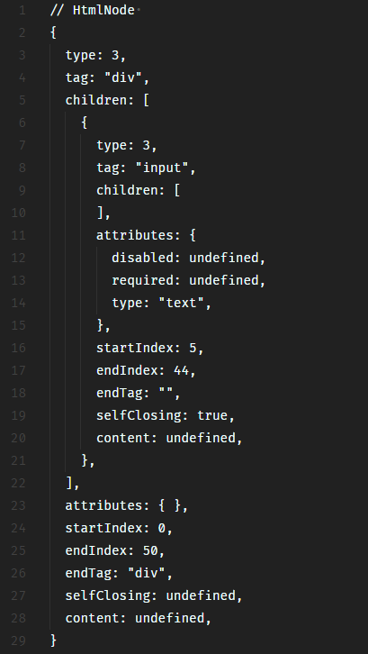

# HtmlParser

```html
<div><input disabled required type="text" /></div>
```

```js
import { HtmlParser } from "@nmyvision/html-parser";

const hp = new HtmlParser();

let result = hp.parse("<div><input disabled required type='text' /></div>");
```


